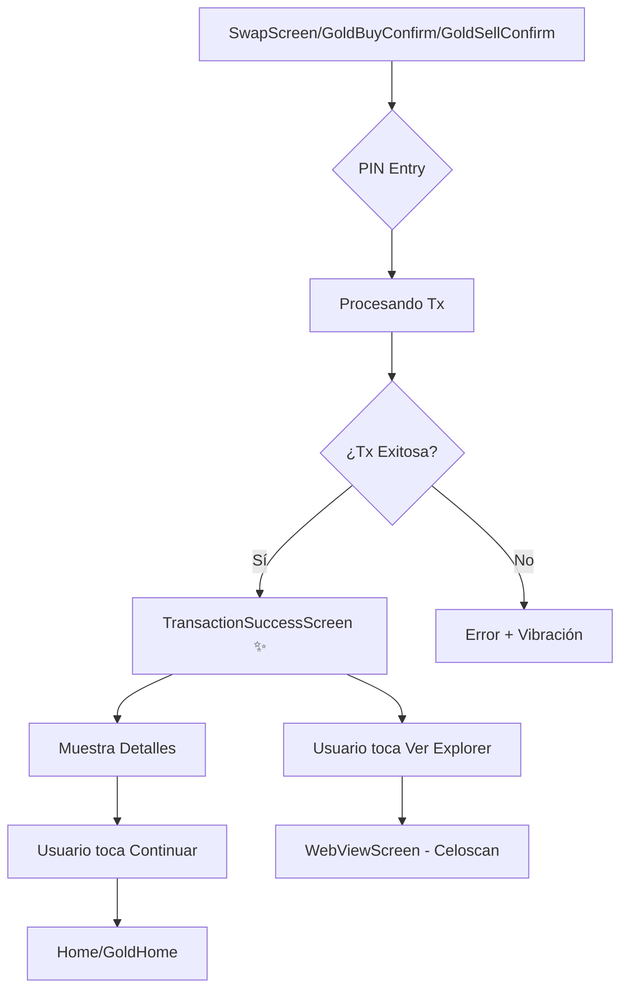

# TuCopWallet - Flujos de Navegación Completos

Este documento describe todos los flujos de navegación de la aplicación TuCopWallet.

## 🏗️ Arquitectura de Navegación

```
App Root
  ├── TabNavigator (Principal)
  │   ├── TabHome
  │   ├── TabWallet
  │   ├── TabActivity
  │   ├── TabDiscover
  │   └── TabEarn
  └── Stack Navigator (Modal/Overlay Screens)
```

---

## 📱 Flujos Principales

### 1. 🏠 FLUJO DE HOME (TabHome)

```
TabHome
  ├──> SendSelectRecipient
  │     ├──> SendEnterAmount
  │     │     └──> SendConfirmation
  │     │           └──> TransactionSuccessScreen ✨
  │     │                 └──> TabActivity
  │     └──> ValidateRecipientIntro
  │           └──> ValidateRecipientAccount
  │
  ├──> SwapScreen
  │     └──> TransactionSuccessScreen ✨ (NUEVO)
  │           └──> TabActivity
  │
  ├──> GoldHome
  │     ├──> GoldInfoScreen
  │     ├──> GoldBuyEnterAmount
  │     │     └──> GoldBuyConfirmation
  │     │           └──> TransactionSuccessScreen ✨ (NUEVO)
  │     │                 └──> TabActivity
  │     ├──> GoldSellEnterAmount
  │     │     └──> GoldSellConfirmation
  │     │           └──> TransactionSuccessScreen ✨ (NUEVO)
  │     │                 └──> TabActivity
  │     └──> GoldPriceAlerts
  │
  ├──> ReFiColombiaSubsidies
  │
  └──> NotificationCenter
```

### 2. 💰 FLUJO DE WALLET (TabWallet)

```
TabWallet
  ├──> TokenDetails
  │     ├──> SwapScreen
  │     │     └──> TransactionSuccessScreen ✨
  │     │           └──> TabActivity
  │     ├──> SendSelectRecipient
  │     ├──> FiatExchangeAmount (Cash In/Out)
  │     │     ├──> SelectProvider
  │     │     ├──> ExternalExchanges
  │     │     └──> CashInSuccess ✅
  │     └──> TransactionDetailsScreen
  │           └──> WebViewScreen (Block Explorer)
  │
  └──> TokenImport
```

### 3. 📊 FLUJO DE ACTIVIDAD (TabActivity)

```
TabActivity
  └──> TransactionDetailsScreen
        ├──> WebViewScreen (Block Explorer)
        └──> (Retry handlers si falla)
```

### 4. 🌟 FLUJO DE EARN (TabEarn)

```
TabEarn
  ├──> EarnInfoScreen
  ├──> EarnPoolInfoScreen
  │     └──> EarnEnterAmount
  │           └──> EarnConfirmationScreen
  │                 └──> TransactionSuccessScreen ✨
  │                       └──> TabActivity
  │
  └──> MarranitoStaking
        └──> MarranitosMyStakes
```

### 5. 🔍 FLUJO DE DISCOVER (TabDiscover)

```
TabDiscover
  ├──> DappsScreen
  └──> DappShortcutsRewards
        └──> DappShortcutTransactionRequest
```

---

## 🔐 Flujos de Autenticación y Seguridad

### ONBOARDING (Primera vez)

```
Welcome
  ├──> ProtectWallet
  │     ├──> ImportSelect
  │     │     └──> ImportWallet
  │     │           └──> PincodeSet
  │     │                 └──> EnableBiometry
  │     │                       └──> VerificationStartScreen
  │     │                             └──> VerificationCodeInputScreen
  │     │                                   └──> OnboardingSuccessScreen ✅
  │     │                                         └──> TabHome
  │     │
  │     └──> OnboardingRecoveryPhrase
  │           └──> PincodeSet
  │                 └──> (continúa arriba)
  │
  └──> Language (selector de idioma)
```

### BACKUP & RECOVERY

```
BackupIntroduction
  └──> AccountKeyEducation
        └──> BackupPhrase
              └──> BackupQuiz
                    └──> BackupComplete ✅
```

### KEYLESS BACKUP

```
KeylessBackupIntro
  ├──> KeylessBackupPhoneInput
  │     └──> KeylessBackupPhoneCodeInput
  │           └──> KeylessBackupProgress ✅
  │
  └──> SignInWithEmail
        └──> KeylessBackupProgress ✅
```

---

## 💳 Flujos de FIAT (Cash In/Out)

### FIAT EXCHANGES

```
FiatExchangeAmount
  ├──> SelectProvider
  │     ├──> FiatConnectLinkAccount
  │     │     └──> FiatConnectReview
  │     │           └──> FiatConnectTransferStatus ✅
  │     │
  │     ├──> KycLanding
  │     │     ├──> KycPending
  │     │     ├──> KycDenied
  │     │     └──> KycExpired
  │     │
  │     └──> SimplexScreen
  │           └──> CashInSuccess ✅
  │
  └──> SelectOfframpProvider (BucksPay)
        └──> BucksPayBankForm
              └──> BucksPayConfirm
                    └──> BucksPayStatus ✅
```

---

## ⚙️ Flujos de SETTINGS

### SETTINGS PRINCIPAL

```
Profile (Settings)
  ├──> ProfileSubmenu
  │     └──> LinkPhoneNumber
  │           └──> VerificationStartScreen
  │
  ├──> PreferencesSubmenu
  │     ├──> Language
  │     ├──> SelectLocalCurrency
  │     └──> (Data Saver, Haptic Feedback, etc)
  │
  ├──> SecuritySubmenu
  │     ├──> PincodeEnter (Change PIN)
  │     │     └──> PincodeSet
  │     ├──> AccountKeyEducation
  │     ├──> BackupIntroduction
  │     ├──> WalletSecurityPrimer
  │     │     └──> KeylessBackupIntro
  │     └──> WalletConnectSessions
  │
  └──> LegalSubmenu
        ├──> RegulatoryTerms
        ├──> Licenses
        └──> Support
              └──> SupportContact
```

---

## 🔄 Flujos de TRANSACCIONES (Nuevos con TransactionSuccessScreen)

### SWAP FLOW ✨

```
SwapScreen
  └──> (Usuario confirma swap)
        └──> PIN Entry (si está habilitado)
              └──> Transaction Processing
                    ├──> ✅ TransactionSuccessScreen
                    │     ├── Muestra: De/A tokens con montos
                    │     ├── Link al explorador de bloques
                    │     └──> TabActivity (botón Continuar)
                    │
                    └──> ❌ Error (vibración + mantiene en SwapScreen)
```

### GOLD BUY FLOW ✨

```
GoldBuyEnterAmount
  └──> GoldBuyConfirmation
        └──> PIN Entry
              └──> Transaction Processing
                    ├──> ✅ TransactionSuccessScreen
                    │     ├── Muestra: Pesos/Dólares → Oro
                    │     ├── Importa XAUt0 token automáticamente
                    │     └──> TabActivity (botón Continuar)
                    │
                    └──> ❌ Error (vibración + mantiene en Confirmation)
```

### GOLD SELL FLOW ✨

```
GoldSellEnterAmount
  └──> GoldSellConfirmation
        └──> PIN Entry
              └──> Transaction Processing
                    ├──> ✅ TransactionSuccessScreen
                    │     ├── Muestra: Oro → Pesos/Dólares
                    │     └──> TabActivity (botón Continuar)
                    │
                    └──> ❌ Error (vibración + mantiene en Confirmation)
```

### SEND FLOW ✨

```
SendSelectRecipient
  └──> SendEnterAmount
        └──> SendConfirmation
              └──> PIN Entry (si está habilitado)
                    └──> Transaction Processing
                          ├──> ✅ TransactionSuccessScreen
                          │     ├── Muestra: Monto enviado
                          │     ├── Muestra: Destinatario (nombre o dirección)
                          │     ├── Link al explorador de bloques
                          │     └──> TabActivity (botón Continuar)
                          │
                          └──> ❌ Error (vibración + mantiene en SendConfirmation)
```

### EARN DEPOSIT FLOW ✨

```
EarnPoolInfoScreen
  └──> EarnEnterAmount (mode: deposit)
        └──> EarnConfirmationScreen
              └──> PIN Entry
                    └──> Transaction Processing
                          ├──> ✅ TransactionSuccessScreen
                          │     ├── Muestra: De token → A token depositado
                          │     ├── Muestra: Nombre del pool
                          │     ├── Link al explorador de bloques
                          │     └──> TabActivity (botón Continuar)
                          │
                          └──> ❌ Error (vibración + mantiene en Confirmation)
```

### EARN WITHDRAW FLOW ✨

```
EarnPoolInfoScreen
  └──> EarnEnterAmount (mode: withdraw)
        └──> EarnConfirmationScreen
              └──> PIN Entry
                    └──> Transaction Processing
                          ├──> ✅ TransactionSuccessScreen
                          │     ├── Muestra: Tokens retirados del pool
                          │     ├── Muestra: Nombre del pool
                          │     ├── Link al explorador de bloques
                          │     └──> TabActivity (botón Continuar)
                          │
                          └──> ❌ Error (vibración + mantiene en Confirmation)
```

### EARN CLAIM REWARDS FLOW ✨

```
EarnPoolInfoScreen
  └──> EarnConfirmationScreen (mode: claim-rewards)
        └──> PIN Entry
              └──> Transaction Processing
                    ├──> ✅ TransactionSuccessScreen
                    │     ├── Muestra: Recompensas reclamadas
                    │     ├── Muestra: Nombre del pool
                    │     ├── Link al explorador de bloques
                    │     └──> TabActivity (botón Continuar)
                    │
                    └──> ❌ Error (vibración + mantiene en Confirmation)
```

---

## 🔗 Flujos de WALLET CONNECT

```
WalletConnectRequest
  ├──> Type: Session
  │     └──> (Usuario acepta/rechaza conexión)
  │
  ├──> Type: Action
  │     └──> (Usuario firma transacción/mensaje)
  │
  ├──> Type: Loading
  │
  └──> Type: TimeOut
```

---

## 🎯 Flujos de JUMPSTART (Envío con links)

```
JumpstartEnterAmount
  └──> JumpstartSendConfirmation
        └──> JumpstartShareLink ✅
              └──> (Usuario comparte link)
```

---

## 📊 Flujos de POINTS

```
PointsIntro
  └──> PointsHome
        └──> (Visualización de puntos y recompensas)
```

---

## 🎨 Pantallas de ÉXITO Principales

### TransactionSuccessScreen ✨ (Principal)

**Usado por:**

- ✅ Swaps (mismo chain y cross-chain)
- ✅ Compra de Oro Digital
- ✅ Venta de Oro Digital
- ✅ Envíos (Send)
- ✅ Depósitos a Earn
- ✅ Retiros de Earn
- ✅ Claims de Recompensas de Earn

**Características:**

- Ícono de celebración con fondo verde claro
- Título personalizado según tipo de transacción
- Muestra montos: "De" y "A" con TokenDisplay (o solo "Monto" para envíos)
- Muestra destinatario (para envíos) o nombre del pool (para earn)
- Link al explorador de bloques
- Botón "Continuar" que va a TabActivity (historial de transacciones)

**Tipos de transacción soportados:**

- `swap` - Intercambio de tokens
- `goldBuy` - Compra de oro digital
- `goldSell` - Venta de oro digital
- `send` - Envío a otro usuario
- `earnDeposit` - Depósito en pool de earn
- `earnWithdraw` - Retiro de pool de earn
- `earnClaim` - Reclamación de recompensas

### Otras Pantallas de Éxito

- `OnboardingSuccessScreen` - Onboarding completado
- `CashInSuccess` - Cash in completado
- `BackupComplete` - Backup completado
- `JumpstartShareLink` - Link creado para compartir
- `FiatConnectTransferStatus` - Transfer FIAT
- `BucksPayStatus` - Operación BucksPay
- `KeylessBackupProgress` - Backup sin clave

---

## 🎨 Código de Colores de Estados

```
🟦 Azul (primary)    - Pantallas principales, navegación
🟩 Verde (success)   - Pantallas de éxito, confirmación
🟨 Amarillo (warning)- Alertas, advertencias
🟥 Rojo (error)      - Errores, cancelación
⚪ Blanco (default)  - Pantallas neutras, contenido
```

---

## 📝 Notas de Implementación

### TransactionSuccessScreen

- **Ubicación**: `src/transactions/TransactionSuccessScreen.tsx`
- **Navegación**: `noHeaderGestureDisabled` (no se puede volver atrás)
- **Destino al continuar**: `TabActivity` (historial de transacciones)
- **Parámetros requeridos**:
  - `fromTokenId`: string
  - `toTokenId`: string
  - `fromAmount`: string
  - `toAmount`: string
  - `transactionHash`: string
  - `networkId`: NetworkId
  - `type`: 'swap' | 'goldBuy' | 'goldSell' | 'send' | 'earnDeposit' | 'earnWithdraw' | 'earnClaim'
- **Parámetros opcionales**:
  - `recipientAddress`: string - Para tipo 'send'
  - `recipientName`: string - Para tipo 'send'
  - `poolName`: string - Para tipos earn

### Sagas Modificadas

- **swap/saga.ts** (~línea 285): Navega a TransactionSuccessScreen después de swap exitoso
- **gold/saga.ts** (~líneas 246 y 394): Navega a TransactionSuccessScreen después de buy/sell
- **send/saga.ts** (~línea 125): Navega a TransactionSuccessScreen después de envío exitoso
- **earn/saga.ts** (~líneas 268 y 440): Navega a TransactionSuccessScreen después de deposit/withdraw/claim

### Traducciones

- **Español** (`locales/es-419/translation.json`): `transactionSuccess.*`
  - Incluye: swap, goldBuy, goldSell, send, earnDeposit, earnWithdraw, earnClaim
- **Inglés** (`locales/en-US/translation.json`): `transactionSuccess.*`
  - Incluye: swap, goldBuy, goldSell, send, earnDeposit, earnWithdraw, earnClaim

### Comportamiento por Tipo de Transacción

- **swap, goldBuy, goldSell, earnDeposit, earnWithdraw, earnClaim**: Muestra De/A tokens
- **send**: Muestra solo monto y destinatario (no De/A)
- **earnDeposit, earnWithdraw, earnClaim**: Muestra nombre del pool
- **send**: Muestra nombre o dirección del destinatario

---

## 🔍 Pantallas Especiales

### Modal/Overlay Screens

- `ErrorScreen` - Error general de la app
- `UpgradeScreen` - Actualización requerida
- `SanctionedCountryErrorScreen` - País sancionado
- `QRNavigator` - Scanner/Display de QR
- `WebViewScreen` - Navegador interno
- `MultichainBeta` - Beta de multichain

---

## 📱 Estructura de Tabs

```
TabNavigator
  ├── TabHome (🏠)
  │   - Send/Receive
  │   - Swap
  │   - Gold
  │   - Notifications
  │
  ├── TabWallet (💰)
  │   - Lista de tokens
  │   - Balance total
  │   - NFTs
  │
  ├── TabActivity (📊)
  │   - Historial de transacciones
  │   - Filtros
  │
  ├── TabDiscover (🔍)
  │   - Dapps
  │   - Rewards
  │
  └── TabEarn (🌟)
      - Pools de Earn
      - Staking (Marranitos)
```

---

## 🔄 Navegación Común

### Funciones de Navegación

- `navigate(screen, params)` - Navega a una pantalla
- `navigateHome()` - Va a TabHome
- `popToScreen(screen)` - Limpia stack y va a screen
- `goBack()` - Vuelve atrás

### Headers Comunes

- `noHeader` - Sin header
- `headerWithBackButton` - Header con botón atrás
- `noHeaderGestureDisabled` - Sin header, sin gesto de volver
- `emptyHeader` - Header vacío

---

## 📊 Estadísticas del Proyecto

- **Total de Screens**: ~120+
- **Screens principales**: ~80
- **Screens modales**: ~25
- **Screens de éxito**: 8
- **Tabs principales**: 5
- **Flujos de onboarding**: 2 (nuevo usuario, importar)
- **Flujos de backup**: 2 (manual, keyless)
- **Flujos de transacciones**: 5+ (send, swap, gold, earn, fiat)

---

## 🚀 Flujo Nuevo - TransactionSuccessScreen

Este es el flujo principal que acabamos de implementar:



**Beneficios:**

- ✅ Feedback visual claro del éxito
- ✅ Usuario ve exactamente qué recibió
- ✅ Acceso rápido al explorador de bloques
- ✅ Experiencia consistente entre swap y gold
- ✅ Vibración háptica de éxito
- ✅ Previene navegación accidental (no back gesture)

---

Última actualización: 2026-04-02
Versión: 1.118.0 (build: 1021081759)
