# TuCOP Wallet - Architecture Diagrams (Mermaid)

## High-Level Architecture

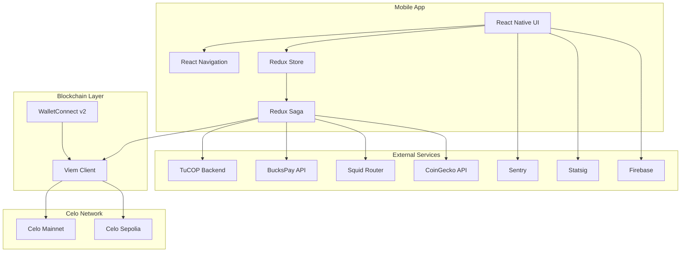

## Navigation Architecture

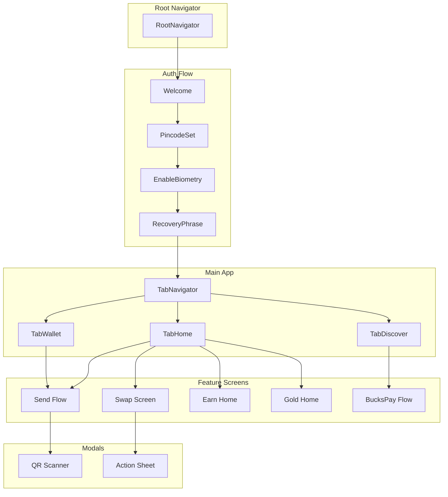

## Redux State Architecture

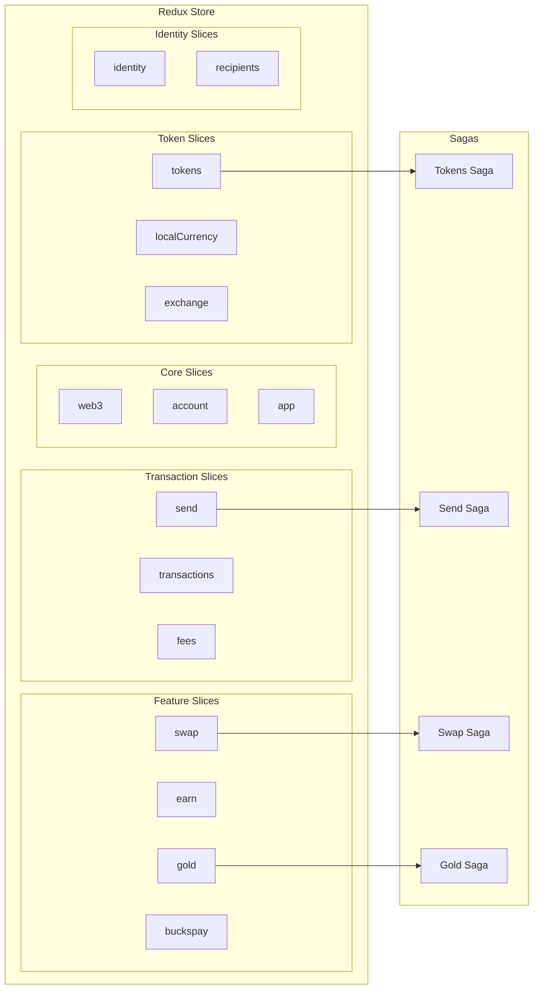

## Send Flow

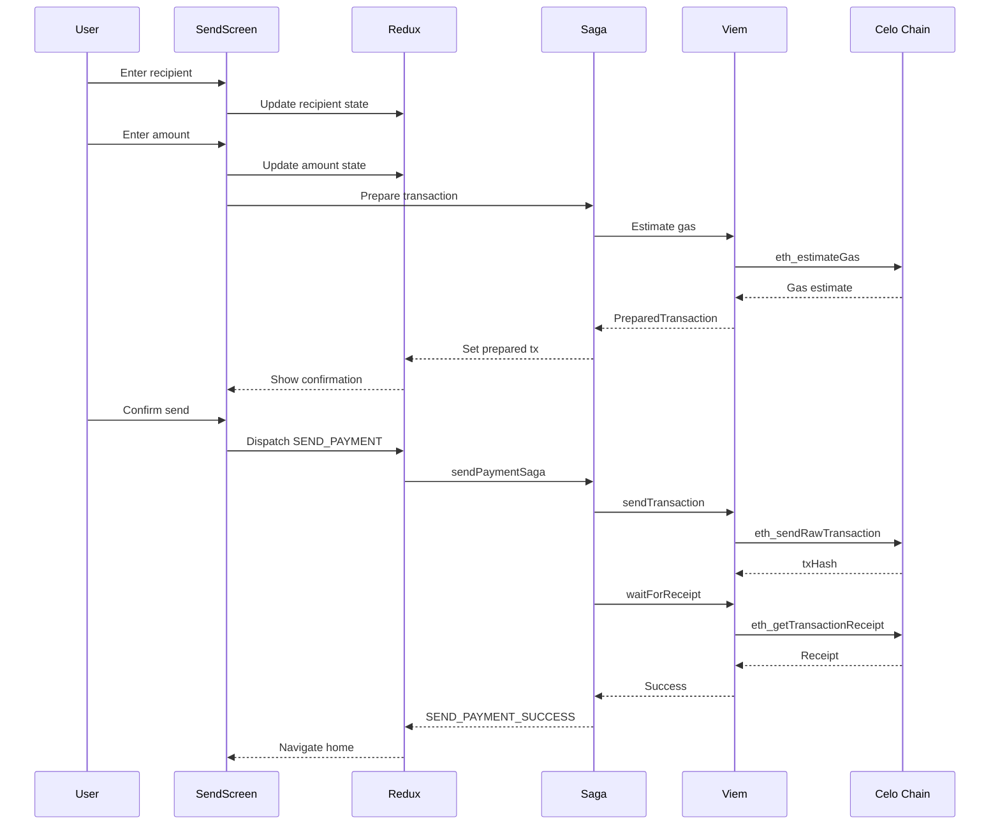

## Swap Flow

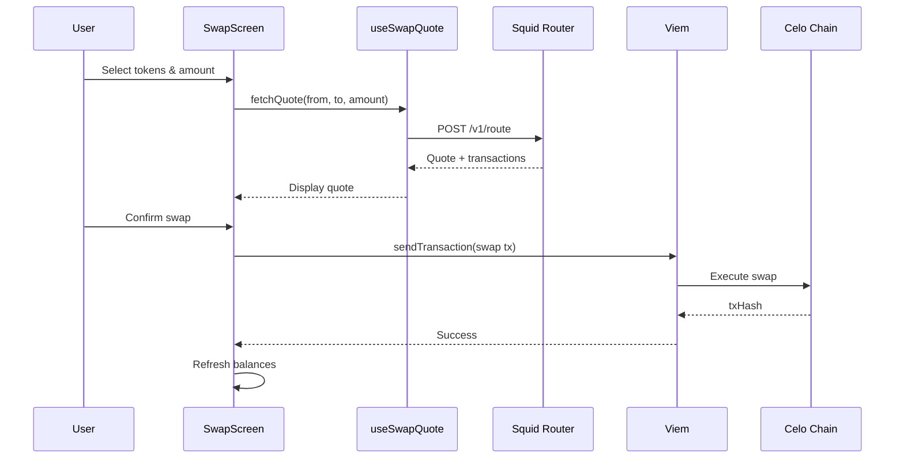

## Gold Buy Flow

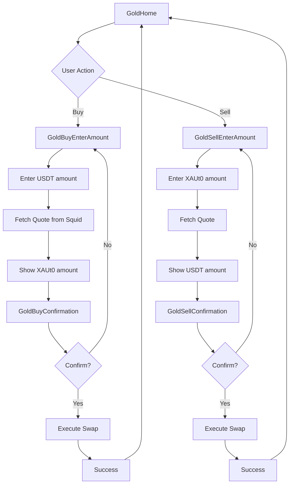

## BucksPay Offramp Flow

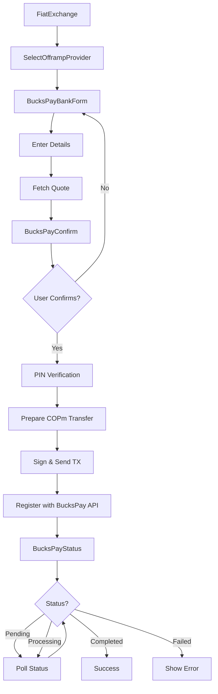

## Token Balance Architecture

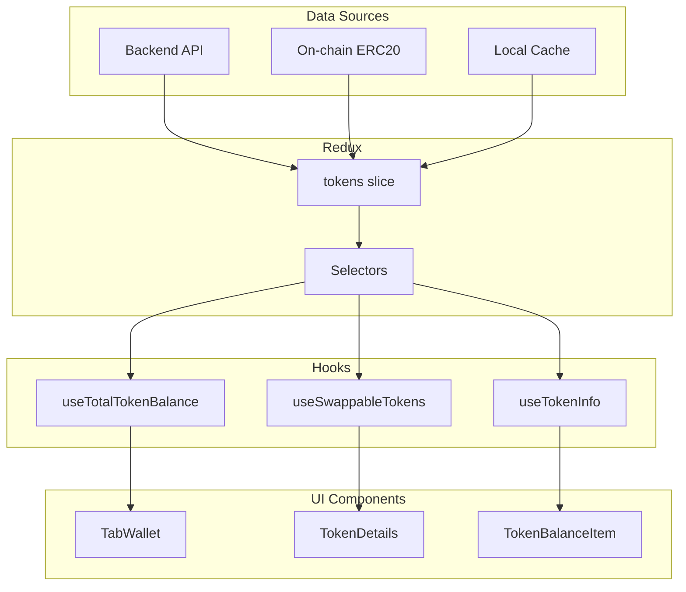

## Onboarding State Machine

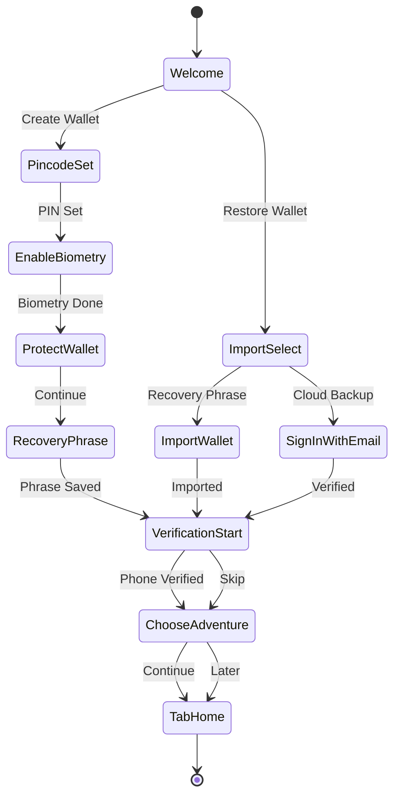

## Error Handling Flow

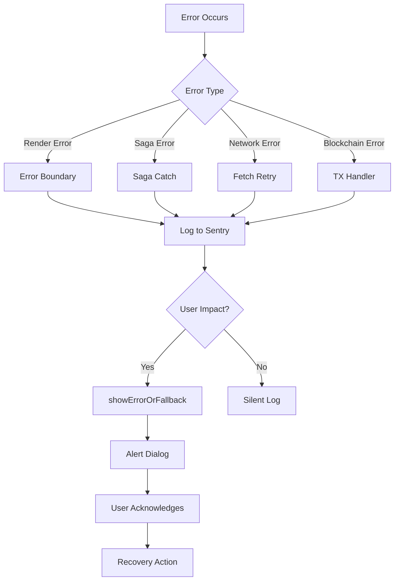

## Feature Flag Architecture

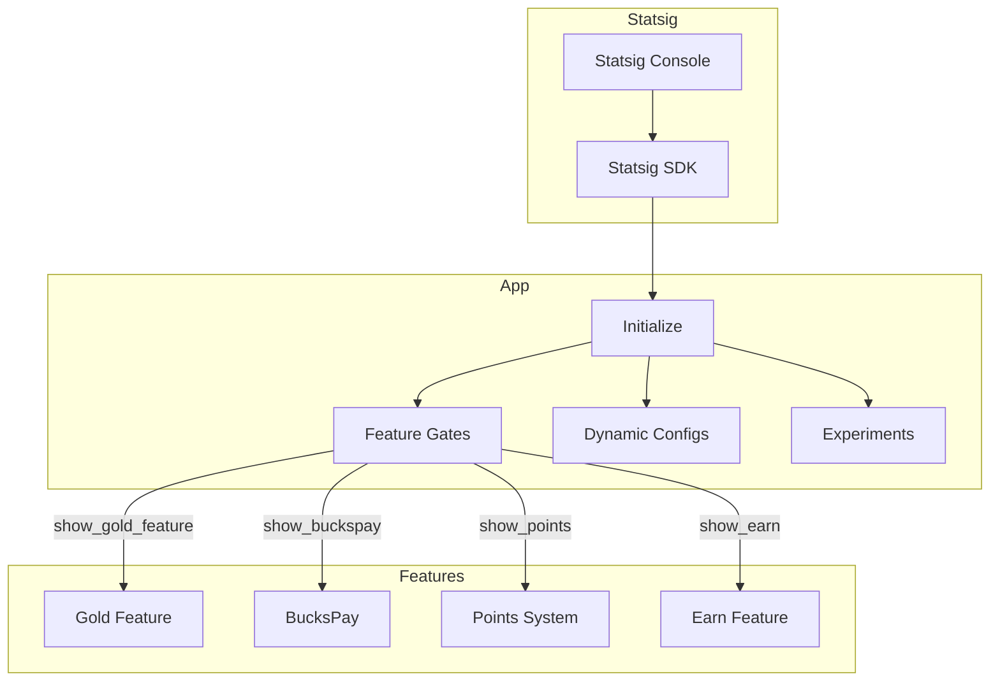

## Related Documentation

- [Architecture Overview](../OVERVIEW.md)
- [Redux Documentation](../modules/redux.md)
- [Navigation Documentation](../modules/navigation.md)
- [ADR Index](../../adr/)
